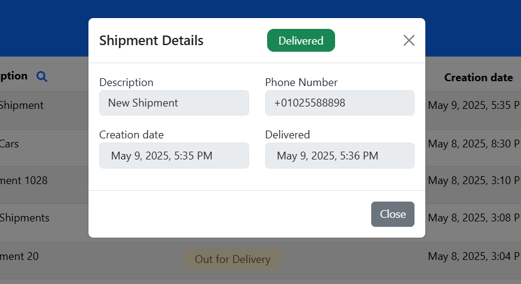

# Logistics Management System

A single-page logistics system that enables merchants to manage and track their shipments through a simple, intuitive interface.

## 📦 Project Overview

This application allows merchants to:

- View all shipments in a paginated table
- Filter shipments by status and description
- Create new shipments
- Update shipment status as it progresses through stages:
  - **Ready to Pick Up**
  - **Out for Delivery**
  - **Delivered**
- Cancel (delete) shipments if needed

The system aims to improve shipment visibility, streamline delivery operations, and enhance the overall merchant experience.

---

## 🛠 Tech Stack

- **Frontend**: Angular v18
- **Backend**: NestJS v11
- **Database**: SQLite
- **ORM**: Prisma

---

## 🚀 Setup Instructions

### 1. Backend Setup

Navigate to the backend folder, then run:

```bash
npm install
npx prisma generate
npx prisma migrate dev --name init
npm run start:dev
```

This will:
- Install dependencies
- Generate the Prisma client
- Create and apply the initial database schema
- Start the NestJS backend

The backend will run on http://localhost:3000

### 2. Frontend Setup
Navigate to the frontend folder, then run:

```bash
npm install
ng serve
```
This will start the Angular frontend on http://localhost:4200

---

## 📸 Screenshots

### Main Dashboard


### Create Shipment Modal


### View Shipment Details


---

## ✅ Usage

- Click the **"New"** button in the top bar to **create a new shipment**.
- Use the **search icons** in the table headers to **filter shipments** by:
  - **Description**
  - **Status**
- Click the **eye icon** 👁️ to **view shipment details**.
- Click the **circular button** in the **"Next Step"** column to **progress the shipment status** through:
  - Ready to Pick Up → Out for Delivery → Delivered
- Click the **trash icon** 🗑️ to **delete a shipment**.

